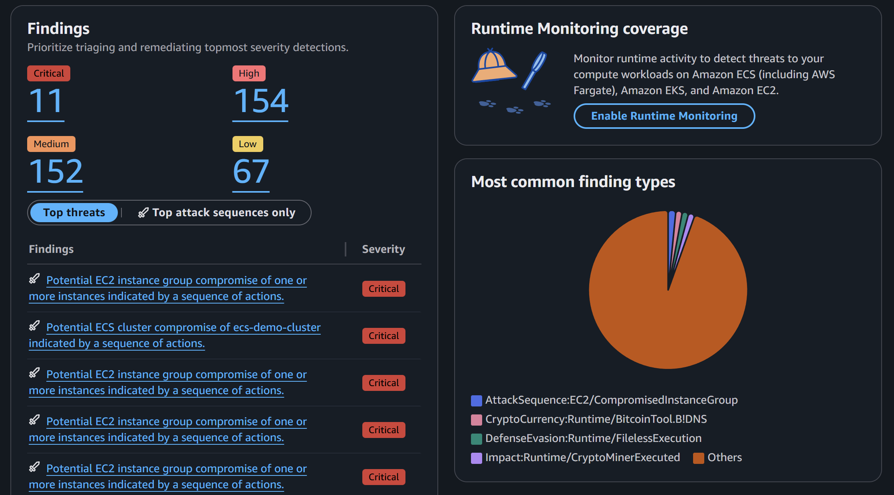
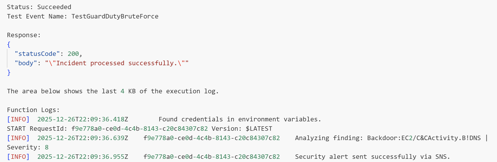
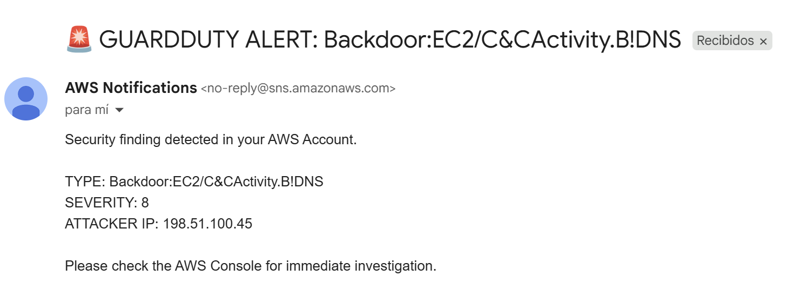

# AWS Threat Detection & Automated Incident Response (SOC) 🛡️🔍

## 📝 Overview
This project implements a **Security Operations Center (SOC)** automation workflow on AWS. It focuses on real-time threat detection and automated response to security incidents. By leveraging **Amazon GuardDuty** for intelligent threat monitoring and **AWS Lambda** for automated alerting, this infrastructure minimizes the mean time to respond (MTTR) to malicious activities.

## 🏗️ Architecture Workflow
The system follows a reactive security pattern:
1. **CloudTrail** records all account activities.
2. **GuardDuty** analyzes logs using Machine Learning to detect anomalies (e.g., Brute Force, unauthorized access).
3. **EventBridge** triggers a response when a high-severity finding occurs.
4. **AWS Lambda** (Python) processes the finding and extracts indicators of compromise (IoC) like the attacker's IP.
5. **Amazon SNS** sends an instant email alert to the security administrator.

## 🛠️ Technology Stack
- **Amazon GuardDuty:** Continuous security monitoring and threat detection.
- **AWS CloudTrail:** Audit logs for all account actions.
- **AWS Lambda:** Serverless compute for incident processing (Python 3.12).
- **Amazon SNS:** Managed notification service for real-time alerting.
- **Amazon EventBridge:** Event bus to route security findings to response functions.

## 🛡️ Implementation Details

### Detection: GuardDuty Findings
- Activated GuardDuty and simulated threats to validate the detection engine.
- **Evidence:** 

### Processing: Serverless Response (Lambda)
- Developed a Python-based Lambda function to parse GuardDuty JSON events and identify the attacker's source IP.
- **Security Validation (Unit Test):**
  

### Alerting: Real-time Notifications (SNS)
- Integrated SNS to bridge the gap between detection and human intervention.
- **Incident Alert Received:**
  

## 🚩 Security Assessment
- **Visibility:** CloudTrail ensures 100% auditability of management events, preventing "silent" attacks.
- **Intelligence:** GuardDuty's ML-based detection identifies patterns that traditional static firewalls might miss.
- **Response Speed:** Automating the notification process ensures that critical issues (Severity 8.0+) are communicated within seconds.
